# Architektur

Diese Datei beschreibt den technischen Aufbau von VP Routing und das Zusammenspiel der wichtigsten Komponenten.

## Überblick

VP Routing besteht aus einem browserbasierten Frontend, einem FastAPI-Backend und einer Routing-Logik, die OpenStreetMap-Daten mit NetCDF-Wetterdaten kombiniert.

Die Anwendung berechnet Routen auf Basis von Straßen- bzw. Wegenetzen und kann zusätzliche Wetterinformationen in die Bewertung der Route einbeziehen.

## Projektstruktur

```text
VPRouting/
│
├── backend/                    # Backend Ordner
│   ├── api.py                  # API-Einstiegspunkt
│   ├── utils_forecast.py       # Wetter-/Forecast-Logik
│   ├── utils_graph.py          # Graph-Handling
│   ├── utils_nc_file.py        # NetCDF-Dateien
│   ├── utils_routingmodels.py  # Routing-Modelle
│   └── data/
│       ├── graphs/             # gespeicherte Graphen mit Indexierung
│       │   ├── *.graphml
│       │   └── index.json
│       └── NC/                 # NetCDF-Wetterdaten
│           ├── *.nc
│           └── NC_for_Cellid.nc
│
├── frontend/                   # Frontend Ordner
│   └── vp_routing.html
│
├── scripts/
│   └── startup/                # Start-/Vorbereitungsskripte
│       ├── reduce_nc_to_grid_geometry.py
│       └── startup.py
│
├── docs/                       # Dokumentation
│   ├── installation.md
│   ├── startup.md
│   └── architecture.md
│
├── environment.yml             # Conda-Umgebung
├── requirements.txt            # zusätzliche pip-Abhängigkeiten
└── README.md                   # Projektübersicht
```

## Frontend

Die Hauptdatei ist:

```text
frontend/vp_routing.html
```

Das Frontend wird lokal im Browser geöffnet und kommuniziert mit dem Backend über HTTP-Anfragen.

Aufgaben des Frontends:

- Darstellung der Karte
- Auswahl von Start- und Zielpunkten sowie der Routingparametern
- Absenden der Routinganfrage an das Backend
- Darstellung der berechneten Route

## Backend

Der Einstiegspunkt der API ist:

```text
backend/api.py
```

Das Backend basiert auf FastAPI und stellt HTTP-Endpunkte für das Frontend bereit.

Aufgaben des Backends:

- Entgegennahme von Routinganfragen
- Validierung der Eingabedaten
- Aufruf der Routing-Logik
- Laden benötigter Wetter- und Kartendaten
- Rückgabe der berechneten Route an das Frontend

Das Backend wird lokal gestartet, siehe dafür hier nach: [docs/startup.md](docs/startup.md)

---

### Routing-Logik

Die Routing-Logik ist für die Berechnung der Route verantwortlich.

Sie verwendet:

- OpenStreetMap-Daten
- Graphstrukturen
- Routingparameter
- optionale Wetterinformationen

Typische Aufgaben:

- Laden oder Erzeugen eines Routinggraphen
- Zuordnung von Start- und Zielpunkten zum Graphen
- Bewertung von Kanten
- Berechnung der optimalen Route
- Rückgabe der Route als Koordinaten oder GeoJSON-ähnliche Struktur

#### Ablaufdiagramm Routinganfrage

```mermaid
flowchart TD
    A[Frontend sendet GET /WAPapi/v1/route] --> B[FastAPI get_route nimmt Parameter entgegen]
    B --> C{speed > 0?}
    C -- nein --> C1[HTTP 400: speed must be > 0]
    C -- ja --> D[Start und Ziel parsen]
    D --> E{Adresse oder Koordinaten?}
    E -- Adresse --> E1[OSMnx geocode]
    E -- Koordinaten --> E2[lat, lon validieren]
    E1 --> F[Geschwindigkeit von km/h in m/s umrechnen]
    E2 --> F

    F --> G[Passende NetCDF-Datei zu start_time suchen]
    G --> H{Datei gefunden und oeffenbar?}
    H -- nein --> H1[HTTP 404]
    H -- ja --> I[xarray Dataset oeffnen]

    I --> J[Quadratische Bounding Box aus Start/Ziel bilden]
    J --> K[Graph aus Cache laden oder neu erstellen]
    K --> L{Passender Graph im Index?}
    L -- ja --> L1[GraphML laden]
    L -- nein --> L2[OSMnx Graph von OSM herunterladen]
    L2 --> L3[Edge-Geometrien fuellen]
    L3 --> L4[Edges per KD-Tree Wetterzellen zuordnen]
    L4 --> L5[GraphML speichern und Index aktualisieren]
    L1 --> M[Naechste Graph-Nodes fuer Start/Ziel bestimmen]
    L5 --> M

    M --> N[Forecast-Zeit aus NC-Dateiname und start_time bestimmen]
    N --> O{routingmodel}
    O -- einfach --> P[static_djikstra]
    O -- advanced --> Q[time_dependent_dijkstra]

    P --> P1[Pro Edge Forecast zur Startzeit lesen]
    P1 --> P2[Kosten = Laenge + Regen-Penalty berechnen]
    P2 --> P3[travel_time pro Edge setzen]
    P3 --> P4[OSMnx shortest_path mit weight=cost]

    Q --> Q1[Priority Queue mit Start-State initialisieren]
    Q1 --> Q2[Naechsten State mit geringsten Kosten entnehmen]
    Q2 --> Q3{Ziel erreicht?}
    Q3 -- ja --> Q4[Pfad aus parent-Tabelle rekonstruieren]
    Q3 -- nein --> Q5[Ausgehende Kanten pruefen]
    Q5 --> Q6[Ankunftszeit je Kante berechnen]
    Q6 --> Q7[Forecast zur Ankunftszeit interpolieren]
    Q7 --> Q8[Regenangepasste Kosten berechnen]
    Q8 --> Q9{Besserer Pfad zum State?}
    Q9 -- ja --> Q10[dist/parent aktualisieren und State einreihen]
    Q9 -- nein --> Q2
    Q10 --> Q2

    P4 --> R[NetCDF Dataset schliessen]
    Q4 --> R
    R --> S[Route mit ox.routing.route_to_gdf in GeoJSON umwandeln]
    S --> T[Backend gibt GeoJSON an Frontend zurueck]
    T --> U[Frontend zeichnet Route auf Karte]
```



Die wichtigsten Prozessschritte sind:

1. **API-Vorbereitung:** `backend/api.py` validiert die Anfrage, parst Start/Ziel, konvertiert die Geschwindigkeit und oeffnet die passende NetCDF-Wetterdatei.
2. **Graph-Vorbereitung:** Aus Start und Ziel wird eine Bounding Box berechnet. `get_graph_cached` laedt einen passenden Graphen aus `data/graphs/index.json` oder erstellt einen neuen OSMnx-Bike-Graphen. Neue Graphen erhalten direkt `cell_i`, `cell_j` und `cell_id`, damit jede Edge einer Wetterzelle zugeordnet ist.
3. **Node-Zuordnung:** Start- und Zielkoordinaten werden auf die naechsten Nodes im Graphen gemappt.
4. **Modellauswahl:** Bei `routingmodel=einfach` werden alle Edge-Kosten einmalig mit dem Forecast zur Startzeit berechnet. Bei `routingmodel=advanced` wird waehrend Dijkstra fuer jede Kante die erwartete Ankunftszeit berechnet und der Forecast fuer diesen Zeitpunkt verwendet.
5. **Rueckgabe:** Nach der Pfadberechnung wird das NetCDF-Dataset geschlossen, die Route in ein GeoJSON-aehnliches Format konvertiert und ans Frontend zur Darstellung zurueckgegeben.

---

## Wetterdaten

Die Wetterdaten liegen als NetCDF-Dateien im Projektordner.

Erwarteter Pfad:

```text
backend/data/NC/
```

Beispiel:

```text
backend/data/NC/1712345678.nc
```

Für die Zuordnung von OSM-Kanten zum Wetterraster wird bevorzugt folgende Datei verwendet:

```text
backend/data/NC/NC_for_Cellid.nc
```

Aufgaben der Wetterdatenintegration:

- Laden der NetCDF-Dateien
- Zuordnung von Koordinaten oder Kanten zu Wetterzellen
- Bereitstellung wetterbezogener Werte für die Routingbewertung
- Einfluss auf die Gewichtung einzelner Routenabschnitte

---

## Datenfluss

Der typische Ablauf einer Routinganfrage:

1. Nutzer wählt Start- und Zielpunkt im Frontend.
2. Das Frontend sendet eine Anfrage an das FastAPI-Backend.
3. Das Backend validiert die Anfrage.
4. Die Routing-Logik lädt benötigte Karten- und Wetterdaten.
5. Start- und Zielpunkt werden dem OSM-Graphen zugeordnet.
6. Die Kanten des Graphen werden bewertet.
7. Die optimale Route wird berechnet.
8. Das Backend gibt die Route an das Frontend zurück.
9. Das Frontend stellt die Route auf der Karte dar.

---

---

## Schnittstellen

Die wichtigste Schnittstelle zwischen Frontend und Backend ist die FastAPI-API.

Lokale API-Adresse:

```text
http://127.0.0.1:8000
```

Swagger-Dokumentation:

```text
http://127.0.0.1:8000/docs
```

OpenAPI-Spezifikation:

```text
http://127.0.0.1:8000/openapi.json
```

---

## Laufzeitverhalten

Zur Laufzeit müssen folgende Komponenten verfügbar sein:

- aktive Conda-Umgebung
- gestartetes FastAPI-Backend
- vorhandene NetCDF-Wetterdaten
- Internetverbindung für OSM-/OSMnx-Abfragen, sofern Daten nicht gecacht sind
- lokal geöffnetes Frontend im Browser

---

## Architekturentscheidungen

Wichtige Entscheidungen im Projekt:

- FastAPI wird als Backend-Framework verwendet.
- Das Frontend ist zunächst als lokale HTML-Datei umgesetzt.
- Conda wird für die Installation von GIS- und Scientific-Abhängigkeiten genutzt.
- NetCDF wird als Format für Wetterdaten verwendet.
- OpenStreetMap dient als Grundlage für Routingdaten.

---

## Abgrenzung

Diese Datei beschreibt die Architektur auf hoher Ebene.

Weitere Details befinden sich in:

- `docs/installation.md`
- `docs/quickstart.md`
- `docs/weather-data.md`
- `docs/routing.md`
- `docs/api.md`
