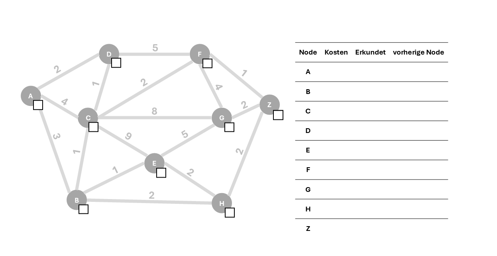
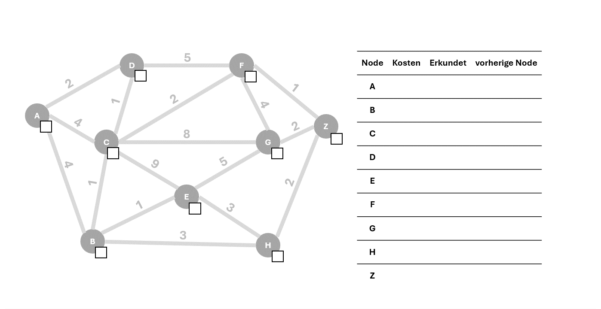

# Routing-Logik

Diese Datei beschreibt die Routingmodelle, die Kostenberechnung und die Verwendung von Wetterdaten in der Routenbewertung.

---

## Überblick

Die Wetter Routing App berechnet Fahrradrouten auf Basis von OpenStreetMap-Graphen. Die Kanten werden nicht nur nach ihrer Länge, sondern zusätzlich ebenfalls aufgrund des Niederschlags bewertet. Dadurch werden Streckenabschnitte mit ungünstigen Wetterbedingungen höher gewichtet, sodass der Fahrradfahrer gelangt möglichst trocken ans Ziel gelangt.

Die Routinglogik ist Teil der FastAPI-Verarbeitung. Eine Anfrage kommt über den Endpunkt `/WAPapi/v1/route` ins Backend, wird in `backend/api.py` vorbereitet und anschliessend an eines der Routingmodelle übergeben.

Die Routingmodelle werden in folgender Datei verwaltet:

```text
backend/utils_routingmodels.py
```


Weitere Einordnung zum gesamten Ablauf befindet sich in:

- [Architektur](architecture.html)
- [Wetterdaten](weather-data.html)

---

## Einordnung in den API-Ablauf

Bevor die eigentliche Routenberechnung startet, bereitet das Backend mehrere Daten vor:

1. Start- und Zielpunkt werden aus Adresse oder Koordinaten in WGS84-Koordinaten umgewandelt.
2. Die Geschwindigkeit wird von km/h in m/s konvertiert.
3. Über `get_nc_file(start_time)` wird eine passende NetCDF-Wetterdatei aus `backend/data/NC/` ausgewählt.
4. Aus Start und Ziel wird eine Bounding Box berechnet.
5. Ein passender OSM-Graph wird aus `backend/data/graphs/` geladen oder über OSMnx neu erstellt.
6. Start- und Zielkoordinaten werden den nächstgelegenen Nodes im Graphen zugeordnet.
7. Abhängig vom Parameter `routingmodel` wird `rain` oder `rain+` ausgeführt.

Das Ergebnis der Routingfunktion ist eine Sequenz von Node-IDs. Diese wird danach mit OSMnx in ein GeoJSON-ähnliches Format umgewandelt und an das Frontend zurückgegeben.

---

## Routingmodelle

Aktuell stehen zwei Routingmodelle zur Verfügung:

| Routingmodell | Beschreibung                                                     |
| ------------- | ---------------------------------------------------------------- |
| `rain`        | Bewertet alle Kanten einmalig mit dem Forecast zur Startzeit.    |
| `rain+`       | Bewertet Kanten zeitabhängig anhand der erwarteten Ankunftszeit. |

Beide Modelle verwenden dieselbe Grundidee für die Wetterbewertung: Pro Kante wird ein Forecast-Wert gelesen und daraus mit `compute_rain_adjusted_cost` ein wetterabhängiger Kostenwert berechnet.

### Dijkstra

Den Routingmodellen liegt der Dijkstra-Algorithmus zugrunde. Er wurde 1959 von Edsger W. Dijkstra veröffentlicht und dient dazu, in einem Graphen den kürzesten beziehungsweise kostengünstigsten Pfad zwischen Knoten zu finden. Dabei wird schrittweise immer der aktuell günstigste noch offene Knoten erweitert, bis das Ziel erreicht ist.

Für diese Anwendung eignet sich der Dijkstra-Algorithmus besonders gut, da er einfach nachvollziehbar, robust und flexibel an unterschiedliche Kostenfunktionen anpassbar ist. NetworkX respektive OSMnx verfügen bereits über bestehende Implementierungen, die für das statische Modell rain eingesetzt werden können. Das zeitabhängige Modell rain+ verwendet hingegen eine eigene Implementierung, da die zusätzliche Zeitkomponente von den oben genannten Bibliotheken in der benötigten Form nicht unterstützt wird.

Obwohl der Dijkstra-Algorithmus in bestimmten Anwendungsfällen weniger performant sein kann als heuristische Verfahren wie beispielsweise der A*-Algorithmus, wurde er für dieses Projekt bewusst gewählt. Der Grund dafür liegt darin, dass Dijkstra ohne Heuristik arbeitet und dadurch transparenter sowie einfacher kontrollierbar ist. Dies ist insbesondere für die Integration projektspezifischer Gewichtungen und zeitabhängiger Kosten relevant. Während A* stark von der Wahl einer geeigneten Heuristik abhängt, lässt sich Dijkstra direkter anpassen und erlaubt eine klarere Nachvollziehbarkeit der berechneten Routen. Für dieses Projekt wurde deshalb die bessere Manipulierbarkeit und Interpretierbarkeit höher gewichtet als eine mögliche Performanceoptimierung durch A*.

Die nachfolgende Grafik zeigt grafisch auf, wie sich der Dijkstra-Algorithmus Schritt für Schritt durch den Graphen arbeitet, um die kostengünstigste Route von Node A zu Node Z zu finden:

<div
  class="routing-animation"
  data-frame-base="assets/Dijkstra_GIF/Folie"
  data-frame-extension=".PNG"
  data-total-frames="39"
  style="text-align: center; margin: 1.5rem 0;"
>
  

  <div style="margin-top: 10px;">
    <button type="button" data-action="prev" aria-label="Vorheriger Frame" title="Vorheriger Frame">&#9198;</button>
    <button type="button" data-action="toggle" aria-label="Animation abspielen" title="Animation abspielen">&#9654;</button>
    <button type="button" data-action="next" aria-label="Nächster Frame" title="Nächster Frame">&#9197;</button>
  </div>

  <p class="routing-animation-counter">Frame 1 / 39</p>
</div>

<details style="margin: 1rem 0 1.5rem;">
  <summary>GIF-Version anzeigen</summary>
  <div style="text-align: center; margin-top: 1rem;">
    
  </div>
</details>

## Einfaches Routingmodell: `rain`

Das Modell `rain` verwendet einen statischen Dijkstra-Ansatz und ist im Modul `static_weather_djikstra` umgesetzt.


### Grundidee

Bei diesem Modell werden alle Kanten vor der eigentlichen Wegsuche einmalig bewertet. Der Forecast wird für alle Kanten zur Startzeit der Route gelesen.

Danach wird mit OSMnx der kürzeste Pfad anhand der berechneten Kosten gesucht. Die Route bleibt dadurch einfach nachvollziehbar und ist schneller berechnet als beim zeitabhängigen Modell.

In der nachfolgenden Grafik ist das einfache Routingmodell interaktiv dargestellt:

<div
  class="routing-animation"
  data-frame-base="assets/Dijkstra_rain_GIF/Folie"
  data-frame-extension=".PNG"
  data-total-frames="42"
  style="text-align: center; margin: 1.5rem 0;"
>
  

  <div style="margin-top: 10px;">
    <button type="button" data-action="prev" aria-label="Vorheriger Frame" title="Vorheriger Frame">&#9198;</button>
    <button type="button" data-action="toggle" aria-label="Animation abspielen" title="Animation abspielen">&#9654;</button>
    <button type="button" data-action="next" aria-label="Nächster Frame" title="Nächster Frame">&#9197;</button>
  </div>

  <p class="routing-animation-counter">Frame 1 / 42</p>
</div>

<details style="margin: 1rem 0 1.5rem;">
  <summary>GIF-Version anzeigen</summary>
  <div style="text-align: center; margin-top: 1rem;">
    
  </div>
</details>


### Vorteile

- einfach nachvollziehbar
- schneller als das zeitabhängige Modell
- gut geeignet für kurze Routen
- geringe Komplexität

### Grenzen

- Wetter wird nur zur Startzeit berücksichtigt
- spätere Wetteränderungen entlang der Route werden nicht berücksichtigt
- bei längeren Routen weniger realistisch

---

## Erweitertes Routingmodell: `rain+`

Das Modell `rain+` verwendet einen zeitabhängigen Dijkstra-Ansatz und ist im Modul `td_weather_dijkstra` umgesetzt.

### Grundidee

Bei diesem Modell wird nicht nur betrachtet, welche Kante befahren wird, sondern auch zu welchem Zeitpunkt diese Kante voraussichtlich erreicht wird. Dadurch kann dieselbe Kante je nach Ankunftszeit unterschiedliche Kosten erhalten.

Im Unterschied zum einfachen Modell wird der Forecast während der Suche laufend anhand der erwarteten Ankunftszeit abgefragt. Zwischen den Forecast-Zeitschritten wird interpoliert.

In der nachfolgenden Grafik ist das erweiterte Routingmodell interaktiv dargestellt:

<div
  class="routing-animation"
  data-frame-base="assets/Dijkstra_rainplus_GIF/Folie"
  data-frame-extension=".PNG"
  data-total-frames="49"
  style="text-align: center; margin: 1.5rem 0;"
>
  

  <div style="margin-top: 10px;">
    <button type="button" data-action="prev" aria-label="Vorheriger Frame" title="Vorheriger Frame">&#9198;</button>
    <button type="button" data-action="toggle" aria-label="Animation abspielen" title="Animation abspielen">&#9654;</button>
    <button type="button" data-action="next" aria-label="Nächster Frame" title="Nächster Frame">&#9197;</button>
  </div>

  <p class="routing-animation-counter">Frame 1 / 49</p>
</div>

<details style="margin: 1rem 0 1.5rem;">
  <summary>GIF-Version anzeigen</summary>
  <div style="text-align: center; margin-top: 1rem;">
    
  </div>
</details>

### Vorteile

- realistischere Wetterbewertung
- geeignet für längere Routen
- berücksichtigt zeitliche Änderungen im Forecast
- bewertet Regen dort, wo die Route ihn voraussichtlich erreicht

### Grenzen

- rechenintensiver als das einfache Modell
- komplexere Zustandsverwaltung
- mehr Forecast-Abfragen während der Suche

---

## Kantenbewertung

Für jede Kante wird eine Kostenfunktion berechnet. Die Kosten basieren auf der Kantenlänge und einem wetterabhängigen Zuschlag.

Die Berechnung erfolgt über:

```text
compute_rain_adjusted_cost
```

Datei:

```text
backend/utils_forecast.py
```

Grundformel:

```text
rain_amount = max(forecast, 0)

cost = length * (1 + multiplier * rain_amount^exponent)
```

Wenn kein Regen vorhanden ist:

```text
cost = length
```

Für die höchste Regenempfindlichkeit gilt zusätzlich:

```text
cost = infinity
```

Damit werden Kanten mit Regen vollständig vermieden, sofern eine alternative Route existiert.

Der berechnete Wert wird als `cost` an der Kante gespeichert und für die Pfadsuche verwendet. Zusätzlich wird aus Länge und Geschwindigkeit eine `travel_time` berechnet.

---

### Regenempfindlichkeit `rainresistence`

`rainresistence` steuert, wie stark Regen die Kosten einer Kante erhöht. Der Parameter wird über die API übergeben und an `compute_rain_adjusted_cost` weitergereicht.

| `rainresistence` | `multiplier` | `exponent` | Wirkung                                        |
| ---------------- | -----------: | ---------: | ---------------------------------------------- |
| `highest`        |            - |          - | Regen hat keinen Einfluss auf die Kosten.      |
| `high`           |         25.0 |        1.0 | Regen erhöht die Kosten leicht.                |
| `medium`         |        100.0 |        1.2 | Regen wird deutlich vermieden.                 |
| `low`            |        400.0 |        1.4 | Regenabschnitte werden stark bestraft.         |
| `lowest`         |            - |          - | Kanten mit Regen werden vollständig vermieden. |

Bei `highest` bleibt `cost = length`, auch wenn Regen vorhergesagt ist. Bei `lowest` wird für Kanten mit Regen `cost = infinity` gesetzt.

---

## Graphen

Die Routingmodelle arbeiten auf OSMnx-Graphen. Ein Graph enthält Nodes, Kanten, Kantenlängen und Geometrien. Beim Erstellen eines neuen Graphen werden fehlende Kantengeometrien ergänzt und die Kanten anschliessend mit Wetterzellen verknüpft.

Gespeicherte Graphen befinden sich im Ordner:

```text
backend/data/graphs/
```

Typische Dateien:

- `*.graphml`: gecachte und aufbereitete Graphen
- `index.json`: Verzeichnis der verfügbaren Graphen

Wenn ein passender Graph bereits vorhanden ist, wird er aus dem Cache geladen. Falls kein passender Graph vorhanden ist, wird ein neuer Graph über OSMnx erstellt, mit Wetterzellen ergänzt und gespeichert.

## Wetterzellen auf Kanten

Damit eine Kante mit Wetterdaten bewertet werden kann, besitzt sie Verweise auf eine Zelle im NetCDF-Wetterraster:

- `cell_i`
- `cell_j`
- `cell_id`

Die Zuordnung wird beim Erstellen eines neuen Graphen berechnet und im gespeicherten Graphen abgelegt. Dadurch kann das Routing später direkt den passenden Forecast-Wert pro Kante lesen.

Die detaillierte Beschreibung der Rasteraufbereitung und Zellzuordnung befindet sich in [Wetterdaten](weather-data.html#zuordnung-von-strassenkanten-zu-wetterzellen).

## Wetterdaten im Routing

Im Routing wird die geöffnete NetCDF-Datei nur noch abgefragt. Die Aufbereitung, Aktualisierung, Auswahl der Datei und Zuordnung der Wetterzellen ist in [Wetterdaten](weather-data.html) beschrieben.

Beim einfachen Modell wird der Forecast ohne zeitliche Interpolation zur Startzeit gelesen. Beim erweiterten Modell wird der Forecast zur erwarteten Ankunftszeit interpoliert.

## Ergebnis

Das Ergebnis der Routenberechnung ist ein Node-Pfad. Dieser wird anschliessend in `backend/api.py` mit OSMnx in ein GeoJSON-ähnliches Format umgewandelt.

Die Antwort enthält pro Routensegment unter anderem:

- `osmid`
- `length`
- `cost`
- `travel_time`
- `geometry`

<script>
  document.querySelectorAll(".routing-animation").forEach((animation) => {
    const frame = animation.querySelector(".routing-animation-frame");
    const counter = animation.querySelector(".routing-animation-counter");
    const playButton = animation.querySelector('[data-action="toggle"]');
    const totalFrames = Number(animation.dataset.totalFrames);
    const frameBase = animation.dataset.frameBase;
    const frameExtension = animation.dataset.frameExtension || ".PNG";
    let currentFrame = 1;
    let playing = false;
    let interval = null;

    function framePath(frameNumber) {
      return `${frameBase}${frameNumber}${frameExtension}`;
    }

    function updateFrame() {
      frame.src = framePath(currentFrame);
      counter.innerText = `Frame ${currentFrame} / ${totalFrames}`;
    }

    function nextFrame() {
      currentFrame = currentFrame < totalFrames ? currentFrame + 1 : totalFrames;
      updateFrame();
    }

    function prevFrame() {
      currentFrame = currentFrame > 1 ? currentFrame - 1 : 1;
      updateFrame();
    }

    function stopPlayback() {
      clearInterval(interval);
      playing = false;
      playButton.innerText = "\u25B6";
      playButton.setAttribute("aria-label", "Animation abspielen");
      playButton.setAttribute("title", "Animation abspielen");
    }

    function togglePlayback() {
      if (playing) {
        stopPlayback();
        return;
      }

      interval = setInterval(() => {
        if (currentFrame < totalFrames) {
          nextFrame();
        } else {
          stopPlayback();
        }
      }, 500);

      playing = true;
      playButton.innerText = "\u23F8";
      playButton.setAttribute("aria-label", "Animation pausieren");
      playButton.setAttribute("title", "Animation pausieren");
    }

    animation.querySelector('[data-action="prev"]').addEventListener("click", prevFrame);
    animation.querySelector('[data-action="next"]').addEventListener("click", nextFrame);
    playButton.addEventListener("click", togglePlayback);
  });
</script>
