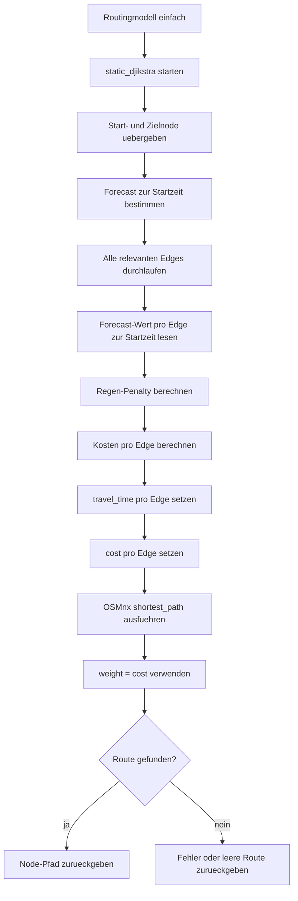
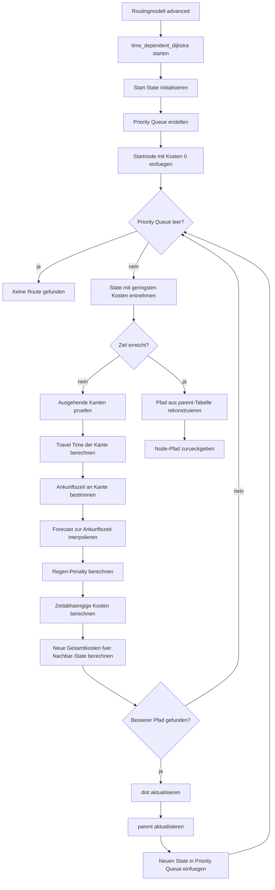

# Routing-Logik

Diese Datei beschreibt die Routing-Modelle, die Kostenberechnung und die Verwendung von Wetterdaten in der Routenbewertung.

---

## Überblick

VP Routing berechnet Routen auf Basis von OpenStreetMap-Graphen.  
Die Kanten des Graphen können zusätzlich mit Wetterdaten bewertet werden, sodass Routen mit ungünstigen Wetterbedingungen höhere Kosten erhalten.

Die Routing-Logik befindet sich hauptsächlich in:

```text
backend/utils_routingmodels.py
```

Zusätzlich werden Funktionen aus folgenden Dateien verwendet:

```text
backend/utils_forecast.py
backend/utils_graph.py
backend/utils_nc_file.py
```

---

## Routing-Modelle

Aktuell stehen zwei Routing-Modelle zur Verfügung:

| Modell | Beschreibung |
|---|---|
| `einfach` | Bewertet alle Kanten einmalig mit dem Forecast zur Startzeit. |
| `advanced` | Bewertet Kanten zeitabhängig anhand der erwarteten Ankunftszeit. |

---

## Einfaches Routingmodell: `einfach`

Das Modell `einfach` verwendet einen statischen Dijkstra-Ansatz.

Implementierung:

```text
static_djikstra
```

Datei:

```text
backend/utils_routingmodels.py
```

### Grundidee

Bei diesem Modell werden alle Kanten vor der eigentlichen Wegsuche einmalig bewertet.  
Der Forecast wird für alle Kanten zur Startzeit der Route gelesen.

Danach wird mit OSMnx der kürzeste Pfad anhand der berechneten Kosten gesucht.

### Ablauf



### Vorteile

- einfach nachvollziehbar
- schneller als das zeitabhängige Modell
- gut geeignet für kurze Routen
- geringe Komplexität

### Grenzen

- Wetter wird nur zur Startzeit berücksichtigt
- spätere Wetteränderungen entlang der Route werden nicht berücksichtigt
- bei längeren Routen weniger realistisch

---

## Erweitertes Routingmodell: `advanced`

Das Modell `advanced` verwendet einen zeitabhängigen Dijkstra-Ansatz.

Implementierung:

```text
time_dependent_dijkstra
```

Datei:

```text
backend/utils_routingmodels.py
```

### Grundidee

Bei diesem Modell wird nicht nur betrachtet, welche Kante befahren wird, sondern auch zu welchem Zeitpunkt diese Kante voraussichtlich erreicht wird.

Dadurch kann dieselbe Kante je nach Ankunftszeit unterschiedliche Kosten erhalten.

### Ablauf



### Vorteile

- realistischere Wetterbewertung
- geeignet für längere Routen
- berücksichtigt zeitliche Änderungen im Forecast
- bewertet Regen dort, wo die Route ihn voraussichtlich erreicht

### Grenzen

- rechenintensiver als `einfach`
- komplexere Zustandsverwaltung
- mehr Forecast-Abfragen während der Suche

---

## Vergleich der Routing-Modelle

| Eigenschaft | `einfach` | `advanced` |
|---|---|---|
| Wetterzeitpunkt | Startzeit | erwartete Ankunftszeit |
| Algorithmus | statischer Dijkstra | zeitabhängiger Dijkstra |
| Geschwindigkeit | schneller | langsamer |
| Genauigkeit bei Wetteränderungen | geringer | höher |
| Geeignet für | kurze oder einfache Routen | längere Routen mit wechselhaftem Wetter |

---

## Kantenbewertung

Für jede Kante wird eine Kostenfunktion berechnet.  
Die Kosten basieren auf der Länge der Kante und einem wetterabhängigen Zuschlag.

Die Berechnung erfolgt über:

```text
compute_rain_adjusted_cost
```

Datei:

```text
backend/utils_forecast.py
```

Grundformel:

```text
rain_amount = max(forecast, 0)
rain_amount = min(rain_amount, 10)

cost = length * (1 + multiplier * rain_amount^exponent)
```

Wenn kein Regen vorhanden ist:

```text
cost = length
```

---

## Regenempfindlichkeit `sensibility`

`sensibility` steuert, wie stark Regen die Kosten einer Kante erhöht.

| `sensibility` | `multiplier` | `exponent` | Wirkung |
|---|---:|---:|---|
| `low` | 25.0 | 1.0 | Regen erhöht die Kosten leicht. |
| `medium` | 100.0 | 1.2 | Regen wird deutlich vermieden. |
| `high` | 400.0 | 1.4 | Regenabschnitte werden stark bestraft. |
| `none` | 2500.0 | 1.8 | Aktueller Code: sehr starke Regenstrafe. |

> Hinweis:  
> Der Wert `none` widerspricht aktuell der Bedeutung „keine Regenberücksichtigung“, da im Code eine sehr hohe Regenstrafe gesetzt wird. Das sollte geprüft oder angepasst werden.

---

## Beispielrechnung

Beispiel für eine Kante mit:

```text
length = 100 m
rain_amount = 0.5
```

| `sensibility` | Berechnung | Ergebnis |
|---|---|---:|
| `low` | `100 * (1 + 25 * 0.5^1.0)` | `1350 m Kosten` |
| `medium` | `100 * (1 + 100 * 0.5^1.2)` | ca. `4453 m Kosten` |
| `high` | `100 * (1 + 400 * 0.5^1.4)` | ca. `15258 m Kosten` |

---

## Graphen

Die Routingmodelle arbeiten auf OSM-Graphen.

Gespeicherte Graphen befinden sich unter:

```text
backend/data/graphs/
```

Typische Dateien:

```text
*.graphml
index.json
```

Wenn ein passender Graph bereits vorhanden ist, wird er aus dem Cache geladen.  
Falls kein passender Graph vorhanden ist, wird ein neuer Graph über OSMnx erstellt und gespeichert.

---

## Wetterzellen auf Kanten

Damit eine Kante mit Wetterdaten bewertet werden kann, besitzt sie Wetterzellen-Attribute:

```text
cell_i
cell_j
cell_id
```

Diese Attribute verweisen auf die passende Position im NetCDF-Wetterraster.

Weitere Details dazu befinden sich in:

```text
docs/weather-data.md
```

---

## Ergebnis

Das Ergebnis der Routenberechnung ist ein Node-Pfad.  
Dieser wird anschließend in ein GeoJSON-ähnliches Format umgewandelt und an das Frontend zurückgegeben.

Die Darstellung der Route erfolgt im Browser über:

```text
frontend/vp_routing.html
```